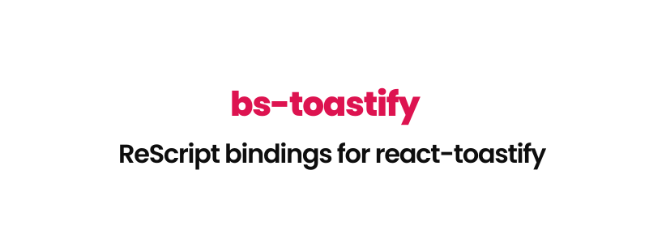

<p align="center">
  <br />
   
</p>
<p align="center">
   <a href="#installation">Installation</a> • 
   <a target="_blank" href="#examples">Examples</a>
</p>
<br/>
<br/>

## Installation
First run the below commands to install the dependencies:
```bash
yarn add bs-toastify -D
yarn add react-toastify
```
Import react-toastify's css somewhere in your code. You can use `[%bs.raw]` if you want to.
```js
import "react-toastify/dist/ReactToastify.css";
```

## Examples
```reason
open ReactToastify;

[@react.component]
let make = () => {
  let handleClick = () => {
    let cb = {
      Js.log("Cool");
      ();
    };
    toast->success(
      "Success",
      ReactToastify.options(
        ~autoClose=3000,
        ~hideProgressBar=false,
        ~closeOnClick=false,
        ~onClose=cb,
        (),
      ),
    );

    toast->warning(
      "Warning",
      ReactToastify.options(
        ~autoClose=3000,
        ~position=`topRight,
        ~hideProgressBar=false,
        ~closeOnClick=false,
        (),
      ),
    );
    ();
  };

  <>
    <ToastContainer position=`topRight autoClose=3000 transition=flip />
    <h1> {"Hello" |> ReasonReact.string} </h1>
    <button onClick={_ => handleClick()}>
      {"Click" |> ReasonReact.string}
    </button>
  </>;
};

let default = make;
```
